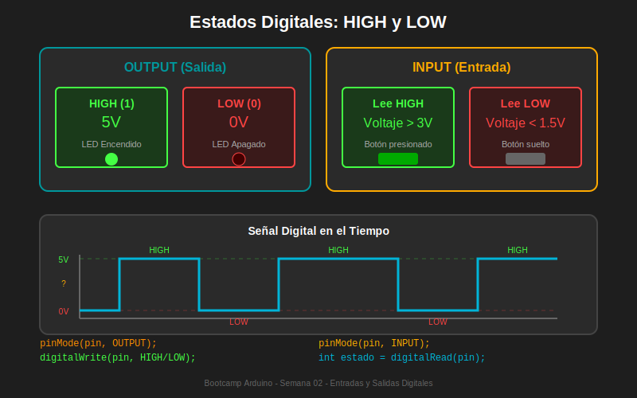

# 📚 Módulo 01: Fundamentos de I/O Digital

> **Semana 02 - Entradas y Salidas Digitales**  
> Tiempo estimado: 20 minutos

---

## 🎯 Objetivos del Módulo

Al finalizar este módulo serás capaz de:

- [ ] Comprender la diferencia entre señales digitales y analógicas
- [ ] Identificar los estados HIGH y LOW en Arduino
- [ ] Configurar pines como entrada o salida
- [ ] Utilizar correctamente `pinMode()`, `digitalRead()` y `digitalWrite()`

---

## 📖 Contenido Teórico

### 1.1 ¿Qué es una Señal Digital?

Una **señal digital** solo puede tener dos estados posibles:

| Estado | Voltaje | Valor Lógico | Significado |
|--------|---------|--------------|-------------|
| **HIGH** | 5V (o 3.3V) | 1 | Encendido / Verdadero |
| **LOW** | 0V | 0 | Apagado / Falso |

```
SEÑAL DIGITAL (solo 2 estados)
     ┌─────┐     ┌─────┐     ┌─────┐
5V ──┤     │     │     │     │     │
     │     │     │     │     │     │
0V ──┘     └─────┘     └─────┘     └─────
       HIGH  LOW   HIGH  LOW   HIGH  LOW
```

> 💡 **Analogía**: Un interruptor de luz tiene dos posiciones: encendido o apagado. No hay estados intermedios.

### 1.2 Diferencia con Señales Analógicas

| Característica | Digital | Analógica |
|----------------|---------|-----------|
| Estados | 2 (HIGH/LOW) | Infinitos |
| Valores | 0 o 1 | 0 a 1023 |
| Función | `digitalRead()` | `analogRead()` |
| Pines | 0-13 | A0-A5 |

```
SEÑAL ANALÓGICA (valores continuos)
      ╱╲    ╱╲
5V ──╱  ╲  ╱  ╲
    ╱    ╲╱    ╲
0V ─              ─────────────
```

### 1.3 Pines Digitales en Arduino Uno

El Arduino Uno R3 tiene **14 pines digitales** (0-13):

```
         ┌──────────────────────────────┐
         │   Arduino Uno R3             │
         │                              │
   AREF ─┤                              │
    GND ─┤                              │
     13 ─┤ ◄── LED integrado (OUTPUT)   │
     12 ─┤                              │
    ~11 ─┤ ◄── PWM                      │
    ~10 ─┤ ◄── PWM                      │
     ~9 ─┤ ◄── PWM                      │
      8 ─┤                              │
      7 ─┤                              │
     ~6 ─┤ ◄── PWM                      │
     ~5 ─┤ ◄── PWM                      │
      4 ─┤                              │
     ~3 ─┤ ◄── PWM + Interrupt          │
      2 ─┤ ◄── Interrupt                │
   TX 1 ─┤ ◄── Serial (evitar)          │
   RX 0 ─┤ ◄── Serial (evitar)          │
         └──────────────────────────────┘
         
   ~ = Pines con capacidad PWM
```

> ⚠️ **Importante**: Los pines 0 y 1 se usan para comunicación Serial. Evita usarlos para I/O si necesitas el Serial Monitor.

---

## 🔧 Funciones Principales

### 1.4 `pinMode()` - Configurar Modo del Pin

Configura un pin como entrada o salida. **Debe llamarse en `setup()`**.

```cpp
// Sintaxis
pinMode(pin, modo);

// Modos disponibles
pinMode(13, OUTPUT);      // Configura pin 13 como salida
pinMode(2, INPUT);        // Configura pin 2 como entrada
pinMode(2, INPUT_PULLUP); // Entrada con resistencia pull-up interna
```

| Modo | Descripción | Uso típico |
|------|-------------|------------|
| `OUTPUT` | Pin como salida | LEDs, relés, buzzer |
| `INPUT` | Pin como entrada | Sensores, botones (con resistencia externa) |
| `INPUT_PULLUP` | Entrada con pull-up interno | Botones (sin resistencia externa) |

### 1.5 `digitalWrite()` - Escribir en Pin

Envía un estado HIGH o LOW a un pin configurado como OUTPUT.

```cpp
// Sintaxis
digitalWrite(pin, estado);

// Ejemplos
digitalWrite(13, HIGH);  // Enciende el LED del pin 13 (5V)
digitalWrite(13, LOW);   // Apaga el LED del pin 13 (0V)
```

**¿Qué ocurre internamente?**

```
digitalWrite(13, HIGH):
┌─────────────────┐
│   Arduino       │
│                 │     ┌─────┐
│  Pin 13 ────────┼─────┤ LED ├────┐
│                 │     └─────┘    │
│  GND ───────────┼────────────────┘
│                 │
└─────────────────┘
      5V fluye → LED se enciende
```

### 1.6 `digitalRead()` - Leer Pin

Lee el estado de un pin configurado como INPUT o INPUT_PULLUP.

```cpp
// Sintaxis
int estado = digitalRead(pin);

// Ejemplos
int valorBoton = digitalRead(2);  // Lee el estado del pin 2

if (digitalRead(2) == HIGH) {
    // El pin está en 5V
}

if (digitalRead(2) == LOW) {
    // El pin está en 0V
}
```

**Valores de retorno:**

| Retorno | Significado | Voltaje |
|---------|-------------|---------|
| `HIGH` (o 1) | Estado alto | ~5V |
| `LOW` (o 0) | Estado bajo | ~0V |

---

## 💻 Ejemplo Práctico Completo

### LED controlado por código

```cpp
/*
 * =================================================
 * PROYECTO: Blink Manual
 * =================================================
 * 
 * ¿Qué hace?
 * Enciende y apaga un LED cada segundo
 * 
 * ¿Para qué?
 * Demostrar el uso de pinMode() y digitalWrite()
 * 
 * Hardware:
 * - Arduino Uno R3
 * - LED integrado (pin 13) o LED externo + resistencia 220Ω
 * 
 * Compatibilidad Tinkercad: ✅
 * =================================================
 */

// =================================================
// DEFINICIÓN DE PINES
// =================================================
const int LED_PIN = 13;  // LED integrado en Arduino

// =================================================
// CONSTANTES DE CONFIGURACIÓN
// =================================================
const int BLINK_DELAY = 1000;  // 1 segundo en milisegundos

// =================================================
// SETUP - Se ejecuta una vez al inicio
// =================================================
void setup() {
    // Configurar pin 13 como salida
    // Esto permite enviar corriente al LED
    pinMode(LED_PIN, OUTPUT);
}

// =================================================
// LOOP - Se repite infinitamente
// =================================================
void loop() {
    // Encender LED (enviar 5V al pin)
    digitalWrite(LED_PIN, HIGH);
    
    // Esperar 1 segundo
    delay(BLINK_DELAY);
    
    // Apagar LED (enviar 0V al pin)
    digitalWrite(LED_PIN, LOW);
    
    // Esperar 1 segundo
    delay(BLINK_DELAY);
}
```

---

## 📊 Diagrama de Referencia



---

## ✅ Autoevaluación

Responde estas preguntas para verificar tu comprensión:

1. **¿Cuántos estados posibles tiene una señal digital?**
   - [ ] Infinitos
   - [x] 2 (HIGH y LOW)
   - [ ] 256

2. **¿En qué función se debe configurar el modo de un pin?**
   - [ ] `loop()`
   - [x] `setup()`
   - [ ] `main()`

3. **¿Qué voltaje representa HIGH en Arduino Uno?**
   - [ ] 0V
   - [ ] 3.3V
   - [x] 5V

4. **¿Qué función usamos para leer el estado de un botón?**
   - [ ] `digitalWrite()`
   - [x] `digitalRead()`
   - [ ] `analogRead()`

---

## 🔗 Recursos Adicionales

- [Arduino Reference: pinMode()](https://www.arduino.cc/reference/en/language/functions/digital-io/pinmode/)
- [Arduino Reference: digitalWrite()](https://www.arduino.cc/reference/en/language/functions/digital-io/digitalwrite/)
- [Arduino Reference: digitalRead()](https://www.arduino.cc/reference/en/language/functions/digital-io/digitalread/)

---

## ➡️ Siguiente Módulo

[Módulo 02: Resistencias Pull-up y Pull-down →](./02-resistencias-pull-up-down.md)
