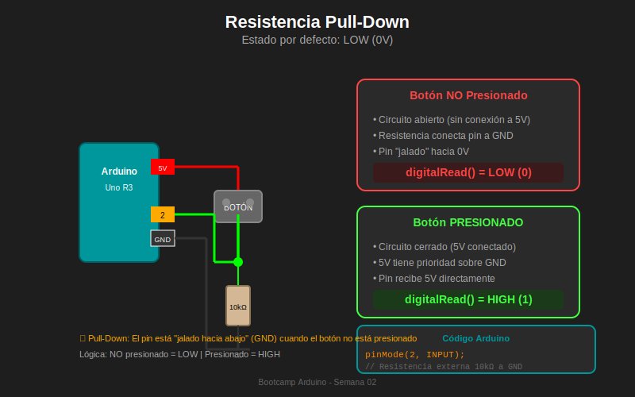
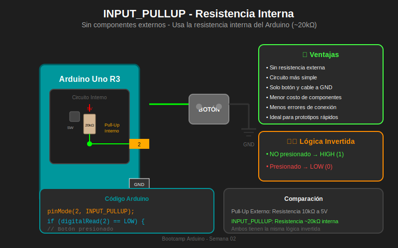

# 📚 Módulo 02: Resistencias Pull-up y Pull-down

> **Semana 02 - Entradas y Salidas Digitales**  
> Tiempo estimado: 25 minutos

---

## 🎯 Objetivos del Módulo

Al finalizar este módulo serás capaz de:

- [ ] Comprender el problema del pin flotante
- [ ] Diferenciar entre resistencias pull-up y pull-down
- [ ] Implementar circuitos con ambos tipos de resistencias
- [ ] Utilizar `INPUT_PULLUP` para simplificar conexiones

---

## 📖 Contenido Teórico

### 2.1 El Problema del Pin Flotante

Cuando un pin digital está configurado como `INPUT` pero no está conectado a nada (o está conectado a un botón abierto), se encuentra en un estado **flotante** o **indeterminado**.

```
PROBLEMA: Pin flotante

Arduino                  Botón
┌─────────┐             ┌───┐
│         │             │   │
│  Pin 2 ─┼─────────────┤   ├──── 5V
│         │             │   │
│   GND ──┼─            └───┘
│         │        (abierto)
└─────────┘

¿Qué lee el pin 2?
→ INDETERMINADO: puede ser HIGH o LOW aleatoriamente
```

**¿Por qué ocurre esto?**

- El pin actúa como una "antena" que capta ruido eléctrico del ambiente
- Las lecturas son impredecibles y pueden cambiar sin presionar el botón
- El resultado es un comportamiento errático del sistema

```
Lectura de pin flotante:
          ┌─┐ ┌┐┌─┐   ┌┐ ┌─┐┌┐
HIGH ─────┘ └─┘└┘ └───┘└─┘ └┘└────
                                    ← Ruido aleatorio
LOW ──────────────────────────────
```

### 2.2 Solución: Resistencias Pull-down

Una **resistencia pull-down** conecta el pin a GND (0V), estableciendo un estado **LOW por defecto**.

```
CIRCUITO PULL-DOWN

        5V
         │
    ┌────┴────┐
    │  BOTÓN  │
    └────┬────┘
         │
         ├──────────────── Pin 2 Arduino
         │
        ┌┴┐
        │ │ 10kΩ (Pull-down)
        │ │
        └┬┘
         │
        ─┴─  GND
        ───
         ─
```

**Funcionamiento:**

| Estado del Botón  | Voltaje en Pin               | `digitalRead()` |
| ----------------- | ---------------------------- | --------------- |
| **NO presionado** | 0V (a través de resistencia) | `LOW`           |
| **Presionado**    | 5V (conexión directa)        | `HIGH`          |

```cpp
// Lógica DIRECTA: presionado = HIGH
if (digitalRead(2) == HIGH) {
    // Botón está presionado
}
```

### 2.3 Solución: Resistencias Pull-up

Una **resistencia pull-up** conecta el pin a 5V, estableciendo un estado **HIGH por defecto**.

```
CIRCUITO PULL-UP

        5V
         │
        ┌┴┐
        │ │ 10kΩ (Pull-up)
        │ │
        └┬┘
         │
         ├──────────────── Pin 2 Arduino
         │
    ┌────┴────┐
    │  BOTÓN  │
    └────┬────┘
         │
        ─┴─  GND
        ───
         ─
```

**Funcionamiento:**

| Estado del Botón  | Voltaje en Pin               | `digitalRead()` |
| ----------------- | ---------------------------- | --------------- |
| **NO presionado** | 5V (a través de resistencia) | `HIGH`          |
| **Presionado**    | 0V (conexión directa a GND)  | `LOW`           |

```cpp
// Lógica INVERTIDA: presionado = LOW
if (digitalRead(2) == LOW) {
    // Botón está presionado
}
```

### 2.4 Comparación Pull-up vs Pull-down

| Característica       | Pull-Down | Pull-Up                |
| -------------------- | --------- | ---------------------- |
| Conexión resistencia | A GND     | A 5V                   |
| Estado por defecto   | LOW       | HIGH                   |
| Al presionar         | HIGH      | LOW                    |
| Lógica               | Directa   | Invertida              |
| Disponible interno   | ❌ No     | ✅ Sí (`INPUT_PULLUP`) |

---

## 🔧 INPUT_PULLUP: La Solución Integrada

Arduino tiene resistencias pull-up **internas** (~20-50kΩ) que puedes activar con `INPUT_PULLUP`.

### Ventajas de INPUT_PULLUP

1. ✅ **Sin componentes externos**: No necesitas resistencia
2. ✅ **Circuito simplificado**: Solo botón y cable a GND
3. ✅ **Menos errores**: Menos conexiones = menos problemas
4. ✅ **Prototipado rápido**: Ideal para pruebas

### Circuito con INPUT_PULLUP

```
CIRCUITO SIMPLIFICADO (sin resistencia externa)

Arduino
┌─────────────┐
│             │
│   ┌─────────┤        ┌────────┐
│   │ ~20kΩ   │        │        │
│   │ interno │        │ BOTÓN  │
│   └────┬────┤ Pin 2 ─┤        ├─┐
│        │    │        │        │ │
│        5V   │        └────────┘ │
│             │                   │
│        GND ─┼───────────────────┘
│             │
└─────────────┘
```

### Código con INPUT_PULLUP

```cpp
/*
 * =================================================
 * PROYECTO: Botón con INPUT_PULLUP
 * =================================================
 *
 * ¿Qué hace?
 * Lee un botón usando la resistencia pull-up interna
 *
 * Conexiones:
 * - Pin 2 → Un terminal del botón
 * - GND → Otro terminal del botón
 *
 * Compatibilidad Tinkercad: ✅
 * =================================================
 */

const int BUTTON_PIN = 2;
const int LED_PIN = 13;

void setup() {
    // INPUT_PULLUP activa resistencia interna de ~20kΩ a 5V
    pinMode(BUTTON_PIN, INPUT_PULLUP);
    pinMode(LED_PIN, OUTPUT);

    Serial.begin(9600);
}

void loop() {
    // Lógica INVERTIDA: LOW = presionado
    if (digitalRead(BUTTON_PIN) == LOW) {
        digitalWrite(LED_PIN, HIGH);
        Serial.println("Botón presionado");
    } else {
        digitalWrite(LED_PIN, LOW);
    }
}
```

---

## 📊 Diagramas de Referencia

### Pull-Down



### Pull-Up


### INPUT_PULLUP Interno



---

## 💡 ¿Cuándo Usar Cada Uno?

### Usa Pull-Down cuando:

- Necesitas lógica directa (presionado = HIGH)
- El circuito requiere pull-down específicamente
- Trabajas con sensores que lo requieren

### Usa Pull-Up / INPUT_PULLUP cuando:

- Quieres simplificar el circuito
- Estás haciendo prototipado rápido
- La lógica invertida no es problema
- **Recomendado para botones en Arduino**

---

## 💻 Ejemplo Comparativo

```cpp
/*
 * =================================================
 * COMPARACIÓN: Pull-down vs INPUT_PULLUP
 * =================================================
 */

// -------------------------------------------------
// OPCIÓN 1: Pull-down externo (resistencia 10kΩ a GND)
// -------------------------------------------------
// Circuito: Botón entre 5V y Pin 2, resistencia entre Pin 2 y GND

void setup_pulldown() {
    pinMode(2, INPUT);  // Sin resistencia interna
}

void loop_pulldown() {
    // Lógica DIRECTA
    if (digitalRead(2) == HIGH) {
        // Botón presionado
    }
}

// -------------------------------------------------
// OPCIÓN 2: INPUT_PULLUP (sin resistencia externa)
// -------------------------------------------------
// Circuito: Botón entre Pin 2 y GND (solo 2 conexiones)

void setup_pullup() {
    pinMode(2, INPUT_PULLUP);  // Resistencia interna activada
}

void loop_pullup() {
    // Lógica INVERTIDA
    if (digitalRead(2) == LOW) {
        // Botón presionado
    }
}
```

---

## ⚠️ Errores Comunes

### 1. Olvidar la resistencia con INPUT

```cpp
// ❌ INCORRECTO - Pin flotante
pinMode(2, INPUT);
// Sin resistencia externa = lecturas aleatorias

// ✅ CORRECTO - Con pull-up interno
pinMode(2, INPUT_PULLUP);
```

### 2. Confundir la lógica

```cpp
// ❌ INCORRECTO - Lógica confundida con INPUT_PULLUP
if (digitalRead(2) == HIGH) {  // Esto es "no presionado"
    // Código que debería ejecutarse al presionar
}

// ✅ CORRECTO
if (digitalRead(2) == LOW) {  // LOW = presionado con pull-up
    // Código cuando el botón está presionado
}
```

### 3. Usar valores de resistencia incorrectos

```cpp
// Valores recomendados para pull-up/pull-down:
// - Mínimo: 1kΩ (evita exceso de corriente)
// - Típico: 10kΩ (balance ideal)
// - Máximo: 100kΩ (más susceptible a ruido)
```

---

## ✅ Autoevaluación

1. **¿Qué problema resuelven las resistencias pull-up/pull-down?**

   - [x] El pin flotante
   - [ ] El consumo de energía
   - [ ] La velocidad de procesamiento

2. **Con INPUT_PULLUP, ¿qué valor tiene el pin cuando el botón NO está presionado?**

   - [x] HIGH
   - [ ] LOW
   - [ ] Indefinido

3. **¿Qué valor de resistencia es típico para pull-up/pull-down?**

   - [ ] 220Ω
   - [x] 10kΩ
   - [ ] 1MΩ

4. **¿Cuál es la ventaja principal de INPUT_PULLUP?**
   - [ ] Mayor velocidad
   - [x] No requiere resistencia externa
   - [ ] Menor consumo

---

## 🔗 Recursos Adicionales

- [Arduino: Digital Pins](https://www.arduino.cc/en/Tutorial/Foundations/DigitalPins)
- [Pull-up vs Pull-down Resistors](https://learn.sparkfun.com/tutorials/pull-up-resistors)

---

## ➡️ Siguiente Módulo

[Módulo 03: Debouncing →](./03-debouncing.md)
