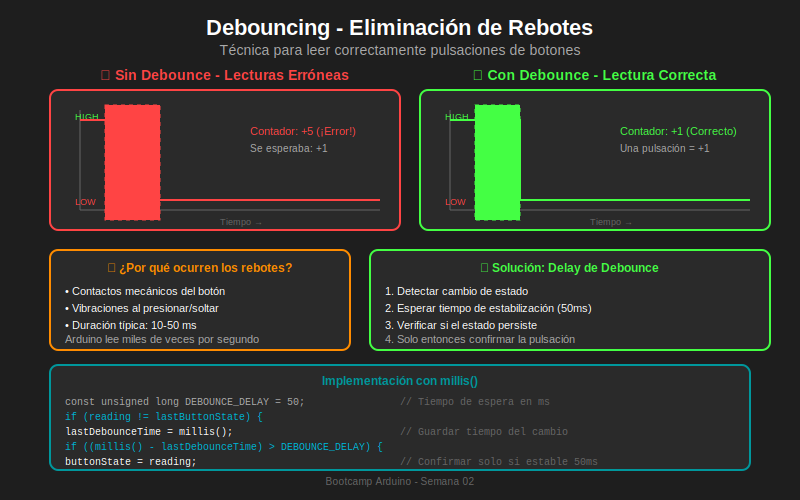

# 📚 Módulo 03: Debouncing - Eliminación de Rebotes

> **Semana 02 - Entradas y Salidas Digitales**  
> Tiempo estimado: 25 minutos

---

## 🎯 Objetivos del Módulo

Al finalizar este módulo serás capaz de:

- [ ] Comprender el fenómeno del rebote mecánico en botones
- [ ] Identificar cuándo es necesario aplicar debounce
- [ ] Implementar debounce por software usando `millis()`
- [ ] Evitar el uso de `delay()` para mantener el programa responsivo

---

## 📖 Contenido Teórico

### 3.1 ¿Qué es el Rebote Mecánico?

Cuando presionas un botón, los contactos metálicos no se conectan limpiamente. Hay **vibraciones mecánicas** que causan múltiples conexiones y desconexiones en milisegundos.

```
REBOTE MECÁNICO (Bouncing)

Presión del botón
      │
      ▼
      ┌─┐┌┐┌─┐  ← Rebotes (5-50ms)
HIGH ─┘ └┘└┘ └───────────────────────
                                      
LOW ──────────────────────────────────
      │        │
      │        └── Estado estable
      └── Zona de rebote
```

### 3.2 El Problema en Arduino

Arduino ejecuta `loop()` miles de veces por segundo. Durante los 10-50ms de rebote, puede hacer cientos de lecturas:

```
Sin Debounce:
┌────────────────────────────────────┐
│ Pulsación física: 1 vez            │
│ Arduino detecta:  5-10 cambios     │
│ Contador suma:    +5 a +10         │
│ Resultado:        ¡INCORRECTO!     │
└────────────────────────────────────┘
```

**Ejemplo del problema:**

```cpp
// ❌ CÓDIGO SIN DEBOUNCE - PROBLEMÁTICO
int counter = 0;
int lastState = HIGH;

void loop() {
    int currentState = digitalRead(BUTTON_PIN);
    
    if (currentState == LOW && lastState == HIGH) {
        counter++;  // ¡Se suma múltiples veces por cada pulsación!
        Serial.println(counter);
    }
    
    lastState = currentState;
}

// Resultado: Una pulsación puede sumar 3, 5, o más al contador
```

### 3.3 Solución: Debounce por Software

La técnica consiste en **ignorar cambios de estado** durante un período corto después de detectar el primer cambio.

```
Con Debounce:
                    
                 ┌── Detectar cambio
                 │   
      ┌─┐┌┐┌─┐   │   ┌─── Esperar 50ms
HIGH ─┘ └┘└┘ └───┼───┤
                 │   │
LOW ─────────────┼───┼────────────────
                 │   │
                 │   └── Confirmar estado
                 │       (si sigue igual)
                 │
              Ignorar rebotes
```

---

## 🔧 Implementación con millis()

### ¿Por qué `millis()` y no `delay()`?

| `delay()` | `millis()` |
|-----------|------------|
| ❌ Bloquea todo el programa | ✅ No bloqueante |
| ❌ No puede hacer otras tareas | ✅ Multitarea posible |
| ❌ Pierde eventos | ✅ Responsivo |

### Código de Debounce Básico

```cpp
/*
 * =================================================
 * PROYECTO: Debounce con millis()
 * =================================================
 * 
 * ¿Qué hace?
 * Detecta pulsaciones de botón eliminando rebotes
 * 
 * ¿Cómo funciona?
 * 1. Detecta cambio de estado en el pin
 * 2. Guarda el tiempo del cambio
 * 3. Espera 50ms sin cambios
 * 4. Confirma el nuevo estado
 * 
 * Hardware:
 * - Arduino Uno R3
 * - Botón conectado entre pin 2 y GND
 * - LED integrado en pin 13
 * 
 * Compatibilidad Tinkercad: ✅
 * =================================================
 */

// =================================================
// DEFINICIÓN DE PINES
// =================================================
const int BUTTON_PIN = 2;
const int LED_PIN = 13;

// =================================================
// CONSTANTES DE CONFIGURACIÓN
// =================================================
const unsigned long DEBOUNCE_DELAY = 50;  // 50 milisegundos

// =================================================
// VARIABLES GLOBALES
// =================================================
int buttonState = HIGH;           // Estado actual confirmado
int lastButtonState = HIGH;       // Última lectura (puede incluir rebotes)
unsigned long lastDebounceTime = 0;  // Tiempo del último cambio

// =================================================
// SETUP
// =================================================
void setup() {
    pinMode(BUTTON_PIN, INPUT_PULLUP);
    pinMode(LED_PIN, OUTPUT);
    Serial.begin(9600);
    
    Serial.println("Sistema iniciado - Presiona el botón");
}

// =================================================
// LOOP
// =================================================
void loop() {
    // 1. Leer el estado actual del botón
    int reading = digitalRead(BUTTON_PIN);
    
    // 2. Detectar si hubo cambio (potencial rebote)
    if (reading != lastButtonState) {
        // Reiniciar el temporizador de debounce
        lastDebounceTime = millis();
    }
    
    // 3. Verificar si ha pasado suficiente tiempo desde el último cambio
    if ((millis() - lastDebounceTime) > DEBOUNCE_DELAY) {
        // El estado es estable por más de 50ms
        
        // 4. Si el estado confirmado cambió, actuar
        if (reading != buttonState) {
            buttonState = reading;
            
            // Detectar flanco de bajada (botón presionado con pull-up)
            if (buttonState == LOW) {
                // Toggle del LED
                digitalWrite(LED_PIN, !digitalRead(LED_PIN));
                Serial.println("¡Pulsación detectada!");
            }
        }
    }
    
    // 5. Guardar la lectura para la próxima iteración
    lastButtonState = reading;
}
```

### Diagrama de Flujo

```
┌─────────────────┐
│  Leer botón     │
│  (reading)      │
└────────┬────────┘
         │
         ▼
┌─────────────────────┐
│ ¿reading cambió?    │
│ (reading !=         │
│  lastButtonState)   │
└─────────┬───────────┘
          │
    ┌─────┴─────┐
    │Sí         │No
    ▼           ▼
┌─────────┐   ┌───────────────────┐
│Reiniciar│   │ ¿Pasaron 50ms?    │
│timer    │   │ (millis() -       │
└────┬────┘   │  lastDebounceTime │
     │        │  > DEBOUNCE_DELAY)│
     │        └─────────┬─────────┘
     │                  │
     │            ┌─────┴─────┐
     │            │Sí         │No
     │            ▼           │
     │     ┌──────────────┐   │
     │     │ ¿Estado      │   │
     │     │ confirmado   │   │
     │     │ cambió?      │   │
     │     └──────┬───────┘   │
     │            │           │
     │      ┌─────┴─────┐     │
     │      │Sí         │No   │
     │      ▼           │     │
     │ ┌─────────────┐  │     │
     │ │ Actualizar  │  │     │
     │ │ y actuar    │  │     │
     │ └──────┬──────┘  │     │
     │        │         │     │
     └────────┴─────────┴─────┘
                  │
                  ▼
         ┌────────────────┐
         │ Guardar        │
         │ lastButtonState│
         │ = reading      │
         └────────────────┘
```

---

## 💡 Variables Explicadas

```cpp
// Estado CONFIRMADO del botón (después del debounce)
int buttonState = HIGH;
// ↑ Este es el valor "real" que usamos para tomar decisiones

// Última LECTURA del botón (puede incluir rebotes)
int lastButtonState = HIGH;
// ↑ Este detecta cambios, incluyendo rebotes

// Tiempo del último cambio detectado
unsigned long lastDebounceTime = 0;
// ↑ Se reinicia cada vez que hay un cambio
//   Solo confirmamos si pasan 50ms sin más cambios
```

---

## 📊 Diagrama de Referencia



---

## 💻 Ejemplo: Contador con Debounce

```cpp
/*
 * =================================================
 * PROYECTO: Contador con Debounce
 * =================================================
 * 
 * ¿Qué hace?
 * Cuenta pulsaciones de botón correctamente
 * 
 * Compatibilidad Tinkercad: ✅
 * =================================================
 */

const int BUTTON_PIN = 2;
const unsigned long DEBOUNCE_DELAY = 50;

int buttonState = HIGH;
int lastButtonState = HIGH;
unsigned long lastDebounceTime = 0;
int pressCount = 0;

void setup() {
    pinMode(BUTTON_PIN, INPUT_PULLUP);
    Serial.begin(9600);
    Serial.println("Contador iniciado en 0");
}

void loop() {
    int reading = digitalRead(BUTTON_PIN);
    
    if (reading != lastButtonState) {
        lastDebounceTime = millis();
    }
    
    if ((millis() - lastDebounceTime) > DEBOUNCE_DELAY) {
        if (reading != buttonState) {
            buttonState = reading;
            
            // Solo contar cuando se PRESIONA (flanco de bajada)
            if (buttonState == LOW) {
                pressCount++;
                Serial.print("Contador: ");
                Serial.println(pressCount);
            }
        }
    }
    
    lastButtonState = reading;
}
```

---

## ⚠️ Errores Comunes

### 1. Usar `delay()` para debounce
```cpp
// ❌ INCORRECTO - Bloquea el programa
if (digitalRead(2) == LOW) {
    delay(50);  // El programa se "congela" 50ms
    // ...
}

// ✅ CORRECTO - No bloqueante
if ((millis() - lastDebounceTime) > DEBOUNCE_DELAY) {
    // ...
}
```

### 2. No guardar `lastButtonState`
```cpp
// ❌ INCORRECTO - Olvida actualizar
void loop() {
    int reading = digitalRead(2);
    if (reading != lastButtonState) {
        lastDebounceTime = millis();
    }
    // ¡Falta: lastButtonState = reading;
}
```

### 3. Tiempo de debounce muy corto
```cpp
// ❌ INCORRECTO - 5ms puede ser insuficiente
const unsigned long DEBOUNCE_DELAY = 5;

// ✅ CORRECTO - 50ms es seguro para la mayoría de botones
const unsigned long DEBOUNCE_DELAY = 50;
```

---

## ✅ Autoevaluación

1. **¿Cuánto dura típicamente el rebote de un botón?**
   - [ ] 1 segundo
   - [x] 10-50 milisegundos
   - [ ] 1 milisegundo

2. **¿Por qué es mejor usar `millis()` que `delay()` para debounce?**
   - [ ] Es más preciso
   - [x] No bloquea el programa
   - [ ] Usa menos memoria

3. **Con INPUT_PULLUP, ¿qué valor indica "botón presionado"?**
   - [ ] HIGH
   - [x] LOW
   - [ ] Ninguno

4. **¿Qué pasa si el tiempo de debounce es muy largo (500ms)?**
   - [ ] Mejor detección
   - [x] Pulsaciones rápidas no se detectan
   - [ ] Mayor precisión

---

## 🔗 Recursos Adicionales

- [Arduino: Debounce Tutorial](https://www.arduino.cc/en/Tutorial/BuiltInExamples/Debounce)
- [Sparkfun: Switch Debouncing](https://learn.sparkfun.com/tutorials/switch-basics/debouncing)

---

## ➡️ Siguiente Módulo

[Módulo 04: Máquinas de Estados →](./04-maquinas-de-estados.md)
