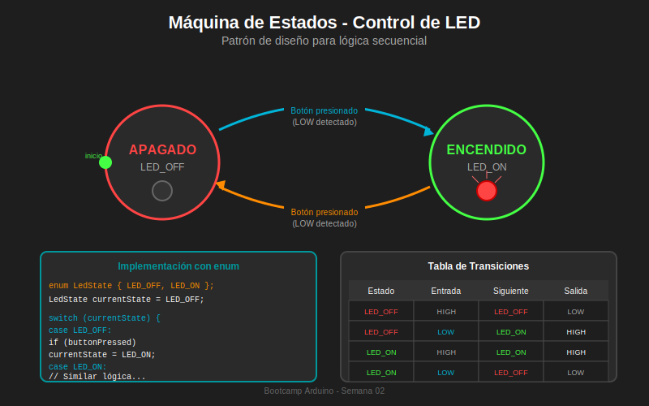

# 📚 Módulo 04: Máquinas de Estados (FSM)

> **Semana 02 - Entradas y Salidas Digitales**  
> Tiempo estimado: 30 minutos

---

## 🎯 Objetivos del Módulo

Al finalizar este módulo serás capaz de:

- [ ] Comprender el concepto de máquina de estados finitos (FSM)
- [ ] Identificar cuándo usar una FSM en proyectos Arduino
- [ ] Implementar FSM usando `enum` y `switch-case`
- [ ] Diseñar diagramas de estados para sistemas simples

---

## 📖 Contenido Teórico

### 4.1 ¿Qué es una Máquina de Estados?

Una **Máquina de Estados Finitos** (FSM - Finite State Machine) es un modelo que describe un sistema que:

1. Tiene un **número finito de estados**
2. Solo puede estar en **un estado a la vez**
3. Cambia de estado según **eventos o condiciones**
4. Ejecuta **acciones** asociadas a cada estado

```
EJEMPLO: Semáforo
                    
    ┌─────────┐  (tiempo)  ┌──────────┐  (tiempo)  ┌─────────┐
    │  VERDE  │ ─────────► │ AMARILLO │ ─────────► │  ROJO   │
    └─────────┘            └──────────┘            └─────────┘
         ▲                                              │
         │                  (tiempo)                    │
         └──────────────────────────────────────────────┘
```

### 4.2 ¿Por qué Usar Máquinas de Estados?

Sin FSM, el código se vuelve complejo:

```cpp
// ❌ CÓDIGO SIN FSM - Difícil de mantener
void loop() {
    if (condition1 && !condition2 && flag3) {
        // hacer algo
        if (anotherCondition) {
            // hacer otra cosa
            if (yetAnother) {
                // más código anidado...
            }
        }
    }
}
```

Con FSM, el código es claro y organizado:

```cpp
// ✅ CÓDIGO CON FSM - Claro y mantenible
void loop() {
    switch (currentState) {
        case STATE_IDLE:
            handleIdle();
            break;
        case STATE_ACTIVE:
            handleActive();
            break;
        case STATE_ERROR:
            handleError();
            break;
    }
}
```

### 4.3 Elementos de una FSM

| Elemento | Descripción | Ejemplo |
|----------|-------------|---------|
| **Estado** | Condición actual del sistema | `LED_ON`, `LED_OFF` |
| **Transición** | Cambio de un estado a otro | Presionar botón |
| **Evento** | Lo que dispara la transición | `buttonPressed` |
| **Acción** | Lo que ocurre al entrar/estar en estado | Encender LED |

---

## 🔧 Implementación en Arduino

### 4.4 Usando `enum` para Estados

```cpp
// Definir los estados posibles
enum LedState {
    LED_OFF,    // Estado 0: LED apagado
    LED_ON      // Estado 1: LED encendido
};

// Variable que guarda el estado actual
LedState currentState = LED_OFF;
```

> 💡 **¿Por qué `enum`?**
> - Código más legible que usar números
> - El compilador verifica valores válidos
> - Autocompletado en el IDE

### 4.5 Usando `switch-case` para Lógica

```cpp
void loop() {
    // Leer entradas
    bool buttonPressed = (digitalRead(BUTTON_PIN) == LOW);
    
    // Máquina de estados
    switch (currentState) {
        case LED_OFF:
            // Acción del estado: LED apagado
            digitalWrite(LED_PIN, LOW);
            
            // Transición: si botón presionado → LED_ON
            if (buttonPressed) {
                currentState = LED_ON;
            }
            break;
            
        case LED_ON:
            // Acción del estado: LED encendido
            digitalWrite(LED_PIN, HIGH);
            
            // Transición: si botón presionado → LED_OFF
            if (buttonPressed) {
                currentState = LED_OFF;
            }
            break;
    }
}
```

---

## 💻 Ejemplo Completo: Toggle LED con FSM

```cpp
/*
 * =================================================
 * PROYECTO: Toggle LED con Máquina de Estados
 * =================================================
 * 
 * ¿Qué hace?
 * Alterna el estado del LED con cada pulsación de botón
 * usando una máquina de estados formal
 * 
 * Estados:
 * - LED_OFF: LED apagado, esperando pulsación
 * - LED_ON: LED encendido, esperando pulsación
 * 
 * Transiciones:
 * - LED_OFF → LED_ON: Al presionar botón
 * - LED_ON → LED_OFF: Al presionar botón
 * 
 * Hardware:
 * - Arduino Uno R3
 * - Botón en pin 2 (INPUT_PULLUP)
 * - LED en pin 13
 * 
 * Compatibilidad Tinkercad: ✅
 * =================================================
 */

// =================================================
// DEFINICIÓN DE PINES
// =================================================
const int BUTTON_PIN = 2;
const int LED_PIN = 13;

// =================================================
// CONSTANTES
// =================================================
const unsigned long DEBOUNCE_DELAY = 50;

// =================================================
// DEFINICIÓN DE ESTADOS
// =================================================
enum LedState {
    LED_OFF,
    LED_ON
};

// =================================================
// VARIABLES GLOBALES
// =================================================
LedState currentState = LED_OFF;

// Variables para debounce
int buttonState = HIGH;
int lastButtonState = HIGH;
unsigned long lastDebounceTime = 0;
bool buttonPressed = false;

// =================================================
// SETUP
// =================================================
void setup() {
    pinMode(BUTTON_PIN, INPUT_PULLUP);
    pinMode(LED_PIN, OUTPUT);
    
    Serial.begin(9600);
    Serial.println("FSM Toggle LED iniciada");
    Serial.println("Estado inicial: LED_OFF");
}

// =================================================
// LOOP
// =================================================
void loop() {
    // 1. Leer entrada con debounce
    buttonPressed = readButtonWithDebounce();
    
    // 2. Ejecutar máquina de estados
    switch (currentState) {
        case LED_OFF:
            stateLedOff();
            break;
            
        case LED_ON:
            stateLedOn();
            break;
    }
}

// =================================================
// FUNCIONES DE ESTADO
// =================================================

/**
 * Estado: LED_OFF
 * Acción: Mantener LED apagado
 * Transición: Si botón presionado → LED_ON
 */
void stateLedOff() {
    // Acción de salida (output)
    digitalWrite(LED_PIN, LOW);
    
    // Verificar condición de transición
    if (buttonPressed) {
        // Transición a LED_ON
        currentState = LED_ON;
        Serial.println("Transición: LED_OFF → LED_ON");
    }
}

/**
 * Estado: LED_ON
 * Acción: Mantener LED encendido
 * Transición: Si botón presionado → LED_OFF
 */
void stateLedOn() {
    // Acción de salida (output)
    digitalWrite(LED_PIN, HIGH);
    
    // Verificar condición de transición
    if (buttonPressed) {
        // Transición a LED_OFF
        currentState = LED_OFF;
        Serial.println("Transición: LED_ON → LED_OFF");
    }
}

// =================================================
// FUNCIÓN DE DEBOUNCE
// =================================================

/**
 * Lee el botón con debounce
 * Retorna true solo en el momento de presionar (flanco)
 */
bool readButtonWithDebounce() {
    bool pressed = false;
    int reading = digitalRead(BUTTON_PIN);
    
    if (reading != lastButtonState) {
        lastDebounceTime = millis();
    }
    
    if ((millis() - lastDebounceTime) > DEBOUNCE_DELAY) {
        if (reading != buttonState) {
            buttonState = reading;
            
            // Detectar solo el flanco de bajada (presión)
            if (buttonState == LOW) {
                pressed = true;
            }
        }
    }
    
    lastButtonState = reading;
    return pressed;
}
```

---

## 📊 Diagrama de Estados



### Tabla de Transiciones

| Estado Actual | Entrada | Siguiente Estado | Salida |
|---------------|---------|------------------|--------|
| LED_OFF | HIGH (no presionado) | LED_OFF | LOW |
| LED_OFF | LOW (presionado) | LED_ON | HIGH |
| LED_ON | HIGH (no presionado) | LED_ON | HIGH |
| LED_ON | LOW (presionado) | LED_OFF | LOW |

---

## 💡 FSM con Múltiples Estados

### Ejemplo: Semáforo Peatonal

```cpp
/*
 * Estados: STOP (rojo), READY (amarillo), GO (verde)
 */

enum TrafficState {
    STOP,    // Peatón debe esperar
    READY,   // Prepararse para cruzar
    GO       // Puede cruzar
};

TrafficState currentState = STOP;
unsigned long stateStartTime = 0;

// Duraciones en milisegundos
const unsigned long STOP_DURATION = 5000;   // 5 segundos
const unsigned long READY_DURATION = 2000;  // 2 segundos
const unsigned long GO_DURATION = 4000;     // 4 segundos

void loop() {
    unsigned long elapsed = millis() - stateStartTime;
    
    switch (currentState) {
        case STOP:
            digitalWrite(RED_PIN, HIGH);
            digitalWrite(YELLOW_PIN, LOW);
            digitalWrite(GREEN_PIN, LOW);
            
            if (elapsed >= STOP_DURATION) {
                currentState = GO;
                stateStartTime = millis();
            }
            break;
            
        case GO:
            digitalWrite(RED_PIN, LOW);
            digitalWrite(YELLOW_PIN, LOW);
            digitalWrite(GREEN_PIN, HIGH);
            
            if (elapsed >= GO_DURATION) {
                currentState = READY;
                stateStartTime = millis();
            }
            break;
            
        case READY:
            digitalWrite(RED_PIN, LOW);
            digitalWrite(YELLOW_PIN, HIGH);
            digitalWrite(GREEN_PIN, LOW);
            
            if (elapsed >= READY_DURATION) {
                currentState = STOP;
                stateStartTime = millis();
            }
            break;
    }
}
```

---

## 🎯 Cuándo Usar FSM

### ✅ Usa FSM cuando:
- El sistema tiene **modos claros** de operación
- Hay **secuencias** de acciones
- Las **condiciones son complejas**
- Necesitas **código mantenible**
- Múltiples botones controlan comportamientos

### ❌ No necesitas FSM cuando:
- Solo hay una acción simple
- No hay estados diferenciados
- El código es muy corto

---

## ⚠️ Errores Comunes

### 1. Olvidar el `break`
```cpp
// ❌ INCORRECTO - Sin break, ejecuta todos los casos
switch (currentState) {
    case LED_OFF:
        digitalWrite(LED_PIN, LOW);
        // ¡Falta break! Continúa al siguiente case
    case LED_ON:
        digitalWrite(LED_PIN, HIGH);
        break;
}

// ✅ CORRECTO
switch (currentState) {
    case LED_OFF:
        digitalWrite(LED_PIN, LOW);
        break;  // ← Importante
    case LED_ON:
        digitalWrite(LED_PIN, HIGH);
        break;
}
```

### 2. Cambiar estado sin debounce
```cpp
// ❌ INCORRECTO - Cambia múltiples veces por rebote
if (digitalRead(BUTTON_PIN) == LOW) {
    currentState = (currentState == LED_OFF) ? LED_ON : LED_OFF;
}

// ✅ CORRECTO - Usar función con debounce
if (readButtonWithDebounce()) {
    currentState = (currentState == LED_OFF) ? LED_ON : LED_OFF;
}
```

---

## ✅ Autoevaluación

1. **¿Cuántos estados puede tener una FSM simultáneamente?**
   - [x] Solo 1
   - [ ] 2 o más
   - [ ] Depende del diseño

2. **¿Qué palabra clave de C++ es ideal para definir estados?**
   - [ ] `const`
   - [x] `enum`
   - [ ] `struct`

3. **¿Qué dispara una transición de estado?**
   - [ ] El tiempo siempre
   - [x] Un evento o condición
   - [ ] Nada, es automático

4. **¿Por qué usar `switch-case` para FSM?**
   - [ ] Es más rápido
   - [x] Código claro y organizado por estados
   - [ ] Usa menos memoria

---

## 🔗 Recursos Adicionales

- [Wikipedia: Finite State Machine](https://en.wikipedia.org/wiki/Finite-state_machine)
- [Arduino State Machine Tutorial](https://www.norwegiancreations.com/2017/03/state-machines-and-arduino-implementation/)

---

## ➡️ Siguiente Sección

[Prácticas: Ejercicios Guiados →](../2-practicas/README.md)
