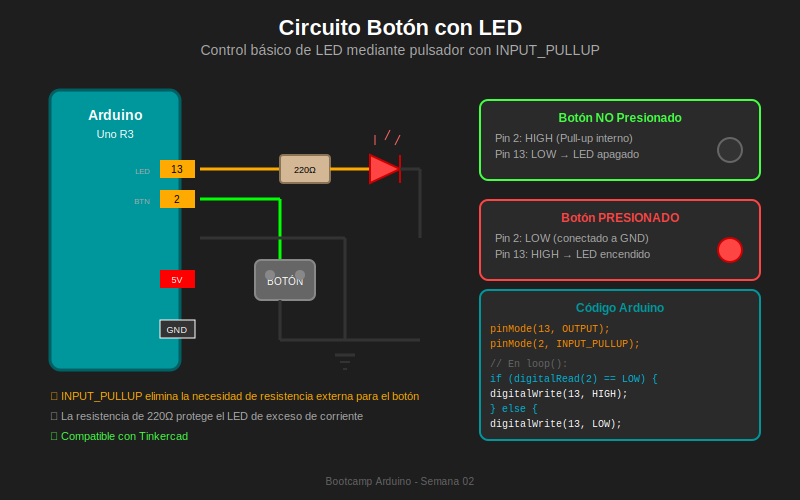

# 🔬 Práctica 01: Botón y LED Básico

> **Nivel**: ⭐ Básico  
> **Tiempo estimado**: 20 minutos  
> **Tinkercad**: ✅ Compatible

---

## 🎯 Objetivos

- [ ] Conectar un botón con INPUT_PULLUP
- [ ] Leer el estado de un pin digital
- [ ] Controlar un LED según el estado del botón
- [ ] Entender la lógica invertida de pull-up

---

## 📚 Teoría Relacionada

- [Módulo 01: Fundamentos I/O Digital](../1-teoria/01-fundamentos-io-digital.md)
- [Módulo 02: Resistencias Pull-up/down](../1-teoria/02-resistencias-pull-up-down.md)

---

## 🔌 Circuito

### Diagrama de Conexiones

```
Arduino Uno R3
┌─────────────────────────────────────────┐
│                                         │
│   Pin 13 ────[220Ω]────►LED────┐       │
│                                │       │
│   Pin 2  ──────────────BTN─────┤       │
│                                │       │
│   GND    ──────────────────────┘       │
│                                         │
└─────────────────────────────────────────┘
```

### Lista de Componentes

| Cantidad | Componente | Valor/Tipo |
|----------|------------|------------|
| 1 | Arduino Uno R3 | - |
| 1 | LED | Rojo (cualquier color) |
| 1 | Resistencia | 220Ω |
| 1 | Pulsador | Normalmente abierto |
| 1 | Protoboard | - |
| 4 | Cables | Jumper |

### Conexiones Paso a Paso

1. **LED**:
   - Ánodo (pata larga, +) → Resistencia 220Ω → Pin 13
   - Cátodo (pata corta, -) → GND

2. **Botón**:
   - Terminal 1 → Pin 2
   - Terminal 2 → GND

---

## 💻 Código

### Versión Básica (Sin Debounce)

```cpp
/*
 * =================================================
 * PRÁCTICA 01: Botón y LED Básico
 * =================================================
 *
 * ¿Qué hace?
 * Enciende el LED mientras el botón está presionado
 *
 * ¿Para qué?
 * Aprender a leer entradas digitales y controlar salidas
 *
 * ¿Cómo funciona?
 * 1. Configura pin 2 como entrada con pull-up interno
 * 2. Configura pin 13 como salida para el LED
 * 3. Lee constantemente el estado del botón
 * 4. Si botón presionado (LOW) → LED encendido
 * 5. Si botón suelto (HIGH) → LED apagado
 *
 * Hardware:
 * - Arduino Uno R3
 * - LED en pin 13 con resistencia 220Ω
 * - Botón entre pin 2 y GND
 *
 * Compatibilidad Tinkercad: ✅
 * =================================================
 */

// =================================================
// DEFINICIÓN DE PINES
// =================================================
const int BUTTON_PIN = 2;   // Pin del botón
const int LED_PIN = 13;     // Pin del LED

// =================================================
// SETUP - Configuración inicial
// =================================================
void setup() {
    // Configurar el botón como entrada con pull-up interno
    // Esto evita necesitar una resistencia externa
    pinMode(BUTTON_PIN, INPUT_PULLUP);

    // Configurar el LED como salida
    pinMode(LED_PIN, OUTPUT);

    // Iniciar comunicación serial para debug
    Serial.begin(9600);
    Serial.println("Práctica 01: Botón y LED Básico");
    Serial.println("Presiona el botón para encender el LED");
}

// =================================================
// LOOP - Bucle principal
// =================================================
void loop() {
    // Leer el estado actual del botón
    int buttonState = digitalRead(BUTTON_PIN);

    // Con INPUT_PULLUP, la lógica es INVERTIDA:
    // - Botón NO presionado = HIGH (5V, pull-up activo)
    // - Botón presionado = LOW (0V, conectado a GND)

    if (buttonState == LOW) {
        // Botón PRESIONADO - Encender LED
        digitalWrite(LED_PIN, HIGH);
        Serial.println("Botón presionado - LED ON");
    } else {
        // Botón NO presionado - Apagar LED
        digitalWrite(LED_PIN, LOW);
    }

    // Pequeña pausa para no saturar el Serial Monitor
    delay(100);
}
```

### Versión Alternativa (Código Compacto)

```cpp
/*
 * Versión compacta del mismo ejercicio
 * Usa el operador ternario y niega la lectura
 */

const int BUTTON_PIN = 2;
const int LED_PIN = 13;

void setup() {
    pinMode(BUTTON_PIN, INPUT_PULLUP);
    pinMode(LED_PIN, OUTPUT);
}

void loop() {
    // Negar la lectura para obtener lógica directa
    // !LOW = HIGH, !HIGH = LOW
    digitalWrite(LED_PIN, !digitalRead(BUTTON_PIN));
}
```

---

## 🧪 Pruebas

### Verificación Básica

1. ✅ Al iniciar, el LED debe estar **apagado**
2. ✅ Al presionar el botón, el LED debe **encenderse**
3. ✅ Al soltar el botón, el LED debe **apagarse**
4. ✅ El Serial Monitor muestra mensajes correctos

### Prueba con Serial Monitor

```
Salida esperada:
---
Práctica 01: Botón y LED Básico
Presiona el botón para encender el LED
Botón presionado - LED ON
Botón presionado - LED ON
(sin mensajes cuando está suelto)
```

---

## 🎮 Desafíos Extra

### Desafío 1: Lógica Invertida
Modifica el código para que el LED esté **encendido por defecto** y se **apague** al presionar el botón.

<details>
<summary>💡 Pista</summary>

Cambia la condición o invierte el estado que escribes al LED.

</details>

<details>
<summary>✅ Solución</summary>

```cpp
void loop() {
    if (digitalRead(BUTTON_PIN) == LOW) {
        digitalWrite(LED_PIN, LOW);   // Apagar al presionar
    } else {
        digitalWrite(LED_PIN, HIGH);  // Encendido por defecto
    }
}
```

</details>

### Desafío 2: Dos Botones, Un LED
Agrega un segundo botón en el pin 3. El LED debe encenderse solo si **ambos** botones están presionados.

<details>
<summary>💡 Pista</summary>

Usa el operador `&&` (AND lógico) para verificar ambas condiciones.

</details>

<details>
<summary>✅ Solución</summary>

```cpp
const int BUTTON_A = 2;
const int BUTTON_B = 3;
const int LED_PIN = 13;

void setup() {
    pinMode(BUTTON_A, INPUT_PULLUP);
    pinMode(BUTTON_B, INPUT_PULLUP);
    pinMode(LED_PIN, OUTPUT);
}

void loop() {
    bool buttonA = (digitalRead(BUTTON_A) == LOW);
    bool buttonB = (digitalRead(BUTTON_B) == LOW);

    if (buttonA && buttonB) {
        digitalWrite(LED_PIN, HIGH);
    } else {
        digitalWrite(LED_PIN, LOW);
    }
}
```

</details>

### Desafío 3: LED Parpadea Mientras Presionas
El LED debe **parpadear** mientras el botón está presionado (no solo encenderse).

<details>
<summary>💡 Pista</summary>

Usa `delay()` para crear el parpadeo dentro del `if`.

</details>

<details>
<summary>✅ Solución</summary>

```cpp
void loop() {
    if (digitalRead(BUTTON_PIN) == LOW) {
        digitalWrite(LED_PIN, HIGH);
        delay(100);
        digitalWrite(LED_PIN, LOW);
        delay(100);
    } else {
        digitalWrite(LED_PIN, LOW);
    }
}
```

</details>

---

## ❌ Errores Comunes

### 1. LED siempre encendido o apagado
**Causa**: Botón mal conectado o sin conexión a GND
```cpp
// Verifica con Serial Monitor
Serial.println(digitalRead(BUTTON_PIN));
// Debe mostrar 1 (suelto) y 0 (presionado)
```

### 2. Confundir la lógica
**Causa**: Olvidar que INPUT_PULLUP invierte la lógica
```cpp
// ❌ Incorrecto (asume lógica directa)
if (buttonState == HIGH) { /* presionado */ }

// ✅ Correcto (lógica invertida con pull-up)
if (buttonState == LOW) { /* presionado */ }
```

### 3. LED muy tenue
**Causa**: Resistencia demasiado alta o conexión incorrecta
```cpp
// Verifica que usas 220Ω, no 22kΩ
// Revisa la polaridad del LED
```

---

## 📊 Diagrama de Referencia



---

## ✅ Checklist de Completitud

- [ ] Circuito armado correctamente
- [ ] Código compila sin errores
- [ ] LED enciende al presionar botón
- [ ] Serial Monitor muestra mensajes
- [ ] Desafío 1 completado (opcional)
- [ ] Desafío 2 completado (opcional)
- [ ] Desafío 3 completado (opcional)

---

## ➡️ Siguiente Práctica

[Práctica 02: Toggle LED con Debounce →](./02-toggle-led-debounce.md)
