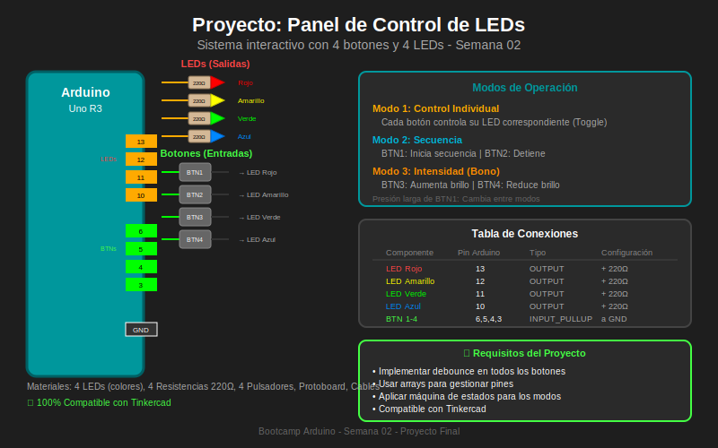

# 🏆 Proyecto Semanal - Semana 02

> **Panel de Control de Iluminación**  
> Tiempo estimado: 1.5 horas

---

## 📋 Descripción del Proyecto

Construirás un **panel de control de iluminación** con 4 botones y 4 LEDs. Este proyecto integra todos los conceptos aprendidos durante la semana: entradas/salidas digitales, debounce, y máquinas de estados.

---

## 🎯 Objetivos del Proyecto

Al completar este proyecto serás capaz de:

- [ ] Integrar múltiples entradas y salidas digitales
- [ ] Aplicar debounce a múltiples botones simultáneamente
- [ ] Implementar una máquina de estados funcional
- [ ] Crear código modular y reutilizable
- [ ] Documentar tu proyecto correctamente

---

## 📊 Diagrama del Sistema



---

## 🔌 Hardware Requerido

| Cantidad | Componente | Especificación |
|----------|------------|----------------|
| 1 | Arduino Uno R3 | - |
| 4 | LEDs | Rojo, Amarillo, Verde, Azul |
| 4 | Resistencias | 220Ω (para LEDs) |
| 4 | Pulsadores | Normalmente abiertos |
| 1 | Protoboard | 830 puntos recomendado |
| ~15 | Cables | Jumper M-M |

---

## 📝 Especificaciones

### Modos de Operación

El sistema debe tener **3 modos de operación**:

| Modo | Nombre | Descripción |
|------|--------|-------------|
| 0 | **Individual** | Cada botón controla su LED (toggle) |
| 1 | **Secuencia** | BTN1 inicia secuencia, BTN2 la detiene |
| 2 | **Intensidad** | BTN3 y BTN4 controlan velocidad de parpadeo |

### Cambio de Modo
- **Presión larga** (>2 segundos) en BTN1 cambia al siguiente modo
- LEDs parpadean 3 veces al cambiar de modo

### Comportamiento por Modo

#### Modo 0: Individual
- BTN1 → Toggle LED1 (Rojo)
- BTN2 → Toggle LED2 (Amarillo)
- BTN3 → Toggle LED3 (Verde)
- BTN4 → Toggle LED4 (Azul)

#### Modo 1: Secuencia
- BTN1 → Inicia secuencia (LEDs se encienden en orden)
- BTN2 → Detiene secuencia (todos apagados)
- BTN3 → Cambia dirección (adelante/atrás)
- BTN4 → Pausa/Continúa

#### Modo 2: Intensidad (Bono)
- Todos los LEDs parpadean juntos
- BTN3 → Aumenta velocidad
- BTN4 → Reduce velocidad
- BTN1/BTN2 → Sin función

---

## 🔌 Diagrama de Conexiones

```
Arduino Uno R3
┌──────────────────────────────────────────────────────────────┐
│                                                              │
│   SALIDAS (LEDs)                ENTRADAS (Botones)          │
│   ══════════════                ══════════════════          │
│                                                              │
│   Pin 13 ──[220Ω]──►LED1────┐   Pin 6 ────────BTN1────┐    │
│   Pin 12 ──[220Ω]──►LED2────┤   Pin 5 ────────BTN2────┤    │
│   Pin 11 ──[220Ω]──►LED3────┤   Pin 4 ────────BTN3────┤    │
│   Pin 10 ──[220Ω]──►LED4────┤   Pin 3 ────────BTN4────┤    │
│                             │                         │    │
│   GND ──────────────────────┴─────────────────────────┘    │
│                                                              │
└──────────────────────────────────────────────────────────────┘

Tabla de Conexiones:
┌─────────────┬─────────┬──────────────┐
│ Componente  │   Pin   │ Configuración│
├─────────────┼─────────┼──────────────┤
│ LED Rojo    │   13    │ OUTPUT       │
│ LED Amarillo│   12    │ OUTPUT       │
│ LED Verde   │   11    │ OUTPUT       │
│ LED Azul    │   10    │ OUTPUT       │
│ Botón 1     │    6    │ INPUT_PULLUP │
│ Botón 2     │    5    │ INPUT_PULLUP │
│ Botón 3     │    4    │ INPUT_PULLUP │
│ Botón 4     │    3    │ INPUT_PULLUP │
└─────────────┴─────────┴──────────────┘
```

---

## 💻 Estructura del Código

### Organización Recomendada

```cpp
// 1. LIBRERÍAS (si las hay)

// 2. DEFINICIÓN DE PINES
const int LED_PINS[] = {13, 12, 11, 10};
const int BTN_PINS[] = {6, 5, 4, 3};
const int NUM_LEDS = 4;
const int NUM_BTNS = 4;

// 3. CONSTANTES
const unsigned long DEBOUNCE_DELAY = 50;
const unsigned long LONG_PRESS_TIME = 2000;
const unsigned long SEQUENCE_DELAY = 200;

// 4. ENUMERACIONES (Estados/Modos)
enum OperationMode {
    MODE_INDIVIDUAL,
    MODE_SEQUENCE,
    MODE_INTENSITY,
    NUM_MODES
};

// 5. ESTRUCTURAS (opcional)
struct Button {
    int state;
    int lastState;
    unsigned long lastDebounce;
    unsigned long pressStart;
};

// 6. VARIABLES GLOBALES
OperationMode currentMode = MODE_INDIVIDUAL;
Button buttons[NUM_BTNS];
bool ledStates[NUM_LEDS];

// 7. SETUP
void setup() { ... }

// 8. LOOP
void loop() { ... }

// 9. FUNCIONES DE MODO
void modeIndividual() { ... }
void modeSequence() { ... }
void modeIntensity() { ... }

// 10. FUNCIONES AUXILIARES
bool checkButtonPress(int btnIndex) { ... }
bool checkLongPress(int btnIndex) { ... }
void allLedsOff() { ... }
void blinkAllLeds(int times) { ... }
```

---

## 📄 Archivos del Proyecto

| Archivo | Descripción |
|---------|-------------|
| [README.md](./README.md) | Este documento |
| [panel-control.ino](./panel-control.ino) | Código completo |
| [DOCUMENTACION.md](./DOCUMENTACION.md) | Documentación técnica |

---

## ✅ Criterios de Evaluación

| Criterio | Puntos | Descripción |
|----------|--------|-------------|
| **Funcionalidad** | 40 | Los 3 modos funcionan correctamente |
| **Debounce** | 20 | Sin rebotes en ningún botón |
| **Código limpio** | 20 | Estructura, nomenclatura, comentarios |
| **Documentación** | 10 | README y comentarios en código |
| **Extras** | 10 | Desafíos adicionales implementados |
| **Total** | **100** | |

---

## 🎮 Desafíos Adicionales (+10 puntos)

1. **Memoria de estado**: Al cambiar de modo, recordar el estado de los LEDs y restaurarlos al volver
2. **Modo demo**: Presión larga en BTN4 activa un modo demo que muestra todos los patrones
3. **Feedback sonoro**: Agregar un buzzer que emita sonido al cambiar de modo
4. **Persistencia**: Guardar el último modo en EEPROM y restaurar al reiniciar

---

## 📝 Entregables

1. **Código fuente** (`panel-control.ino`)
2. **Documentación** (`DOCUMENTACION.md`)
3. **Enlace a Tinkercad** o foto del circuito físico
4. **Video corto** (opcional) mostrando el funcionamiento

---

## ➡️ Archivos del Proyecto

- [Código: panel-control.ino →](./panel-control.ino)
- [Documentación técnica →](./DOCUMENTACION.md)
